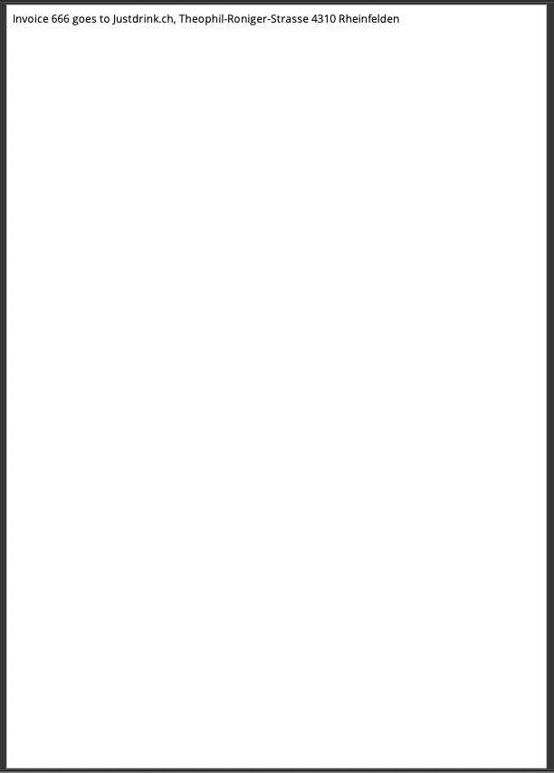

# pdf-generator-lambda
This minimalistic service renders an HTML template with [Mustache](https://github.com/janl/mustache.js) and returns a PDF in DIN-A4 format.

## Usage
Do a `POST` request to your `/renderPdf` endpoint with the following body: 
```
{
    "template":"Invoice {{invoiceNumber}} goes to {{billTo.name}}, {{billTo.street}} {{billTo.zip}} {{billTo.city}}",
    "data":{
        "invoiceNumber":"666"
        "billTo": {
            "name": "John Doe",
            "street": "8213 Mainstreet",
            "zip": "90210",
            "city": "Beverly Hills, CA"
        }
    },
    "desiredFilename": "invoice.pdf"
}
```
This will result in the following PDF



You'll find a more sophisticated example in the `examples` folder.

## Development

### Prerequisites
* [AWS Account](https://aws.amazon.com/)
* [Docker](https://www.docker.com/)
* [Homebrew](https://brew.sh/) (if you're on macOS)
* [AWS SAM CLI](https://docs.aws.amazon.com/serverless-application-model/latest/developerguide/serverless-sam-cli-install.html)

### Invoke the service
Start the local api using `sam local start-api`. Then you're ready to call the service.

```
curl -X "POST" "http://127.0.0.1:3000/renderPdf" \
     -H 'Accept: application/pdf' \
     -H 'Content-Type: application/json; charset=utf-8' \
     -d $'{
  "template": "Invoice {{invoiceNumber}} goes to {{billTo.name}}, {{billTo.street}} {{billTo.zip}} {{billTo.city}}",
  "data": {
    "invoiceNumber": "666",
    "billTo": {
        "name": "John Doe",
        "street": "8213 Mainstreet",
        "zip": "90210",
        "city": "Beverly Hills, CA"
    }
  },
  "desiredFilename": "invoice.pdf"
}'
``` 

## Deployment
Deployment to AWS is pretty easy. Just type `sam build` then `sam deploy --guided`.


